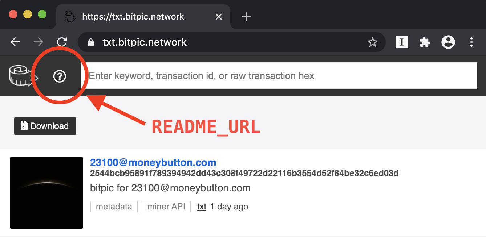

# TXT Change Log

## 0.0.3

To take advantage of this version, please update to the latest `docker-compose.yml`. Quick update:

```
curl https://txt.network/docker-compose.yml > docker-compose.yml && docker-compose up -d
```

Or if you already have the `docker-compose.yml`, simply open it and update the `image` attribute to:

```
image: planaria/txt:0.0.3
```

> See https://txt.network/docker-compose.yml for a full example.

Here are the updates for `v0.0.3`:

### a. Global feed API

v0.0.3 adds support for global feed API using the wildcard path: `/_/_`.

> Since the path syntax is: `/<ChannelName>/<TagName>`, using the wildcard `_` means "Get txs from all channels and all tags".

- Explorer: http://localhost:3013/_/_/
- API version: http://localhost:3013/_/_/json

You can also use it along with other query modifiers, for example https://metatxt.planaria.network/_/_/?limit=3 (Learn more about query modifiers [here](https://txt.network/#/?id=c-queries))

> Here's an example for getting 1 latest confirmed (`at=-null` means block height is not null, therefore confirmed) transaction globally: https://github.com/interplanaria/bitcache/commit/e34feaec2a9f766e79f65f14a0f0a0d49bf6adcc


### b. Status endpoint

In many cases it is necessary to know the current status of the TXT container.

For example, it is helpful to know how many Miner sync tasks are in queue. You can use this information at initial crawl to wait until all the miner sync tasks have been completed, before proceeding to listen mode. (Here's how Bitcache uses the `/status` endpoint to correctly keep track of progress: https://github.com/interplanaria/bitcache/commit/4025be88784f2113f6617d4a1072c5d1ff9692e2

The `/status` endpoint currently returns the miner sync job queue size, but will add additional properties in the future when needed.

> Try: http://localhost:3013/status


### c. Readme URL

You can customize what the question mark link at the top menu bar points to when you click.



Simply change the `docker-compose.yml` file to add a `README_URL` attribute to any HTTP URL. Here's an example:

```
version: '3.5'
services:
  txt:
    image: planaria/txt:0.0.3
    stdin_open: true
    volumes:
      - ./mnt:/root/mnt
    environment:
      - NAME=
      - DESCRIPTION=
      - MINER_URL=https://merchantapi.taal.com
      - README_URL=https://github.com/interplanaria/txt.network
      - TOKEN=
    ports:
      - "3013:3013"
    networks:
      - txt
    logging:
      driver: "json-file"
      options:
        max-size: "100m"
networks:
  txt:
    name: txt
```
